# Desafio Data Science

## Resumo

Olá candidato, o objetivo deste desafio é testar os seus conhecimentos sobre construção de modelos preditivos. Queremos testar os seus conhecimentos dos conceitos estatísticos de modelos preditivos, criatividade na resolução de problemas e aplicação de modelos de machine learning em produção. É importante deixar claro que não existe resposta certa e que nos interessa é sua capacidade de descrever e justificar os passos utilizados na resolução do problema.

## Descrição do Problema
 
O seu objetivo é prever o *churn* (abandono de clientes) de um banco de dados fictício de uma instituição financeira. Para isso são fornecidos dois *datasets*: um *dataset* chamado **Abandono_clientes** composto por 10000 linhas e 13 colunas de informação (*features*), sendo uma coluna “Exited” composta por dados binários: 1 se o cliente abandonou o banco, 0 se não. O segundo *dataset* possui 1000 linhas e 12 colunas e não possui a coluna “Exited”. O seu objetivo é construir um pipeline de Machine Learning que permita prever essa coluna a partir dos dados enviados.** 

## Atividades

1. Descreva graficamente os dados disponíveis, apresentando as principais estatísticas descritivas. Comente o porquê da escolha dessas estatísticas.

2. Explique como você faria a previsão do **Churn** a partir dos dados. Quais variáveis e/ou as suas transformações você utilizou e por quê? Qual tipo de problema estamos a resolvendo (regressão, classificação)? Qual modelo melhor se aproxima dos dados e quais os seus prós e contras? Qual medida de desempenho do modelo foi escolhida e por quê?

3. Construa um pipeline de Machine Learning que realize a previsão de churn a partir de um dataset CSV. Esse pipeline deve ser reproduzível e permitir realizar uma previsão a partir de qualquer arquivo CSV com a mesma estrutura de dados. O modelo utilizado pelo pipeline deve ser treinado com o dataset **Abandono_clientes.csv**. Você deve nos enviar o repositório de código com o pipeline.

4. Envie o resultado do modelo num arquivo com apenas duas colunas (rowNumber, predictedValues) gerado ao rodar o pipeline de 3 no dataset **abandono_teste.csv** em anexo.

## Introdução: O que é um Churn e para que serve?

É muito comum empresas enfrentarem problemas com perdas de clientes e/ou receitas. Para quantificar o número de clientes perdidos podemos usar uma métrica denominada **churn rate**.

No mundo atual, temos inúmeros modelos de negócios por assinaturas (Netflix, Amazon, Spotify, etc.) e poder identificar se o cliente pode ou não cancelar a assinatura tornou-se um problema de negócios. O Churn é entendido como um índice de cancelamentos de clientes que cancelam em determinado período. Para podermos calcular o Churn, o que precisamos fazer é somar o número de clientes que cancelou o seu produto/serviço no período analisado.

Desta forma, se uma empresa deseja fazer uma expansão da base de clientes, é preciso que o número de novos clientes exceda o seu churn rate. Melhor dizendo, a adesão de novos clientes deve ser maior do que a taxa de cancelamentos.

### Qual deve ser a taxa ideal de Churn?

Entendido o que é um churn e qual o seu papel, uma questão que surge é: **Qual deve ser a taxa ideal de Churn?**

Podemos dizer que a melhor taxa de Churn seria 0%, pois isso significa que não temos clientes realizando cancelamento. Contudo, no mundo real isto não é possível. Para entendermos qual deve ser o valor ideal, precisamos entender o seguimento de mercado que estamos envolvidos.

Não existe um valor exato para a taxa de Churn, pois podemos ter diversos fatores que influenciam no Churn. No entanto, de forma geral, pode-se dizer que *5% é uma taxa aceitável** para empresas que trabalham com recorrência, de acordo com [David Pakman](https://pakman.com/churn-is-the-single-metric-that-determines-the-success-of-your-subscription-service-6e82d9d9ea01), cocriador do Music Group da Apple.

### O que levam os clientes a cancelar?

Entender os fatores que levam os clientes a cancelar e os fatores que levam os clientes a aderir ao negócio podem ser uma tarefa difícil, pois muitos fatores podem ser combinados para chegar a uma conclusão.

No entanto, alguns fatores que levam os clientes a cancelar podem ser identificados:

- O cliente está sem fluxo de caixa e não pode mais arcar com a mensalidade do seu produto/serviço;
- Ele não consegue ver valor no produto/serviço;
- O cliente não teve a suas expectativas atendidas;
- O produto ou serviço não acompanha as evoluções de mercado e perde em - qualidade e ferramentas;
- O produto é bom, mas o serviço não – e vice-versa;
- O Seu cliente optou pelo produto da concorrência;
- O Seu cliente foi adquirido por outra empresa e o comprador usa outro serviço;
- Crise financeira no mercado;
- Interrupção da operação durante um período de crise;
- O Seu cliente faliu.

Portanto, para um negócio ser saudável é importante conhecer os indicativos de uso do produto, qualidade do serviço, preço, competição, etc.

## Planejamento do Desafio

Vamos aplicar o método CRISP-DS que é uma variável do método CRISP-DM (Cross-individual System Process for Data Mining) adaptando para o cenário de ciência de dados.

O método CRIS-DS pode ser visualizado na figura abaixo:

    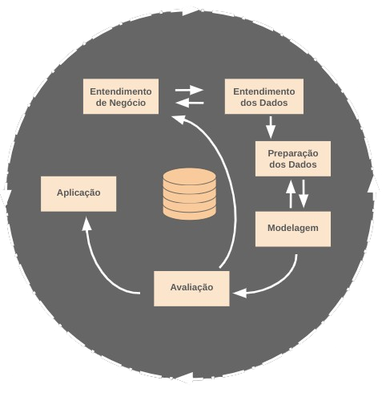

Ele consiste nas seguintes etapas:

1. **Identificar o problema de negócio:**
    - Definir os objetivos e requisitos do negócio;
    - Identificar os problemas que precisam ser resolvidos e como a análise de dados pode ajudar;
    - Formular perguntas de negócios e traduzi-lás em problemas de dados.

2. **Compreensão dos Dados:**
    - Explorar e entender as características principais dos dados.
    - Identificar padrões, tendências e outliers que podem influenciar o processo de modelagem.
    - Garantir que os dados disponíveis estão alinhados com o problema de negócio definido na fase anterior.
    - Envolve sumarizar e visualizar os dados usando estatísticas básicas (média, mediana, desvio padrão) e gráficos (histogramas, boxplots, scatterplots, etc.).
    - Ajuda a entender como as variáveis estão distribuídas, detectar relações entre elas e identificar inconsistências ou dados faltantes.

3. **Preparação dos Dados para modelagem:**
    - Limpar os dados e preencher os valores ausentes;
    - Transformar os dados para melhorar a qualidade dos dados;
    - Normalizar os dados para melhorar a qualidade dos dados;
    - Organizar os dados para melhorar a qualidade dos dados;
    - Dividir os dados em conjuntos de treino e teste;
    - Avaliar a qualidade dos dados;

4. **Modelagem:**
    - Selecionar técnicas de aprendizado de máquina;
    - Construir, treinar e ajustar modelos preditivos ou descritivos;
    - Testas diferentes configurações para encontrar a melhor abordagem;

5. **Avaliação:**
    - Avaliar o desempenho do modelo usando métricas apropriadas;
    - Verificar se o modelo atende aos objetivos de negócio definidos na Fase 1;
    - Ajustar o modelo, se necessário, ou redefinir o problema de dados.

6. **Aplicação:**
    - Implementar o modelo num ambiente de produção;
    - Apresentar os resultados;

## Projeto

### Parte 1 - Entendimento de negócio

Como mencionado no início do documento, estamos tratando de um problema de **Churn**, ou seja, o objetivo principal em problemas como este é determinar se um cliente irá **sair** ou **manter-se**. Isso envolve prever uma variável categórica binária, o que nos levar a lidar com um problema de **classificação binária**. Portanto, queremos criar um modelo preditivo capaz de prever se um cliente vai abandonar o banco ou continuar com ele. Também queremos identificar qual é a taxa de Churn que o nosso modelo prevê, se está acima ou abaixo dos $5\%$.

### Parte 2 - Compreensão dos Dados:

Os dados foram fornecidos pelo idealizador do desafio e simula uma empresa de banco fictícia. Esses dados apresentam as seguintes características:

| Variável           | Significado                                                                 |
|---------------------|-----------------------------------------------------------------------------|
| RowNumber          | Número da linha no conjunto de dados, usado apenas como identificador.     |
| CustomerId         | Identificador único do cliente.                                            |
| Surname            | Sobrenome do cliente.                                                     |
| CreditScore        | Pontuação de crédito do cliente.                                           |
| Geography          | País ou região de origem do cliente.                                       |
| Gender             | Gênero do cliente (masculino ou feminino).                                 |
| Age                | Idade do cliente.                                                         |
| Tenure             | Número de anos que o cliente tem como cliente do banco.                   |
| Balance            | Saldo atual na conta bancária do cliente.                                  |
| NumOfProducts      | Número de produtos bancários que o cliente utiliza.                       |
| HasCrCard          | Indica se o cliente possui um cartão de crédito (1 = sim, 0 = não).        |
| IsActiveMember     | Indica se o cliente é um membro ativo do banco (1 = sim, 0 = não).         |
| EstimatedSalary    | Salário estimado do cliente.                                               |
| Exited             | Indica se o cliente saiu do banco (1 = sim, 0 = não).                      |

A variável target (alvo) será a variável **Exited**. A nossa tarefa consiste em prever se um cliente vai abandonar o banco ou continuar com ele por meios dos dados fornecidos.

Durante a compreensão dos dados, identificamos que não há dados ausentes e a tipologia dos dados estava condizente com o tipo de dados. Em seguida, realizamos análises descritivas que resultaram nas observações a seguir:

#### Analise descritiva e resultados

Inicialmente separamos as variáveis numéricas e categóricas.

Para as variáveis categóricas, quando olhamos para a quantidade e a $\%$ do total, temos as seguintes distribuições:

  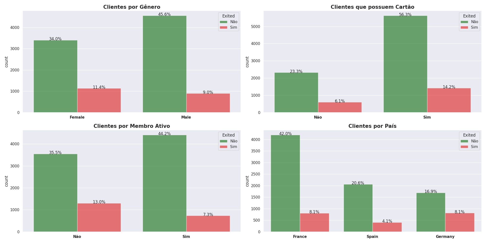

Podemos ver que em valores totais o número de clientes que cancelam é sempre menor comparado com os clientes que não cancelam. Contudo para termos uma melhor visão, devemos olhar também para a taxa em termos de proporções.

Seguimos adiante e olhamos para os valores proporcionais, como podemos ver abaixo:

  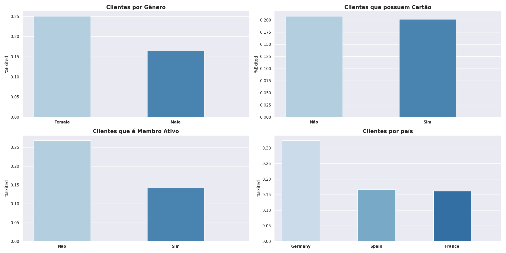

Se comparamos os gráficos por valores totais e por proporção, temos:

- No caso de clientes por Gênero, a taxa de cancelamento por valores totais é de $11.4\%$ para o gênero feminino, enquanto para o mesmo gênero em valores proporcionais chega a $25\%$. Este resultado indica que proporcionalmente, temos que 1/4 do gênero feminino realizam o cancelamento. **Obs.:** É necessário tomarmos cuidado quando realizamos análises. Não queremos reforçar preconceitos e incluir um viés na análise preditiva. Note que a variável categórica **Gênero** nos indica que, proporcionalmente, mulheres tem a maior taxa de cancelamento. Este resultado não deve ser usado com o intuito de impedir o acesso deste gênero ao banco, mas sim de entender o motivo da evasão.

- Para clientes que possuem cartão de crédito, em valores totais é possível ver que número de clientes que não cancelam é bem maior comparado aos que cancelam. Contudo, quando olhamos proporcionalmente, a taxa de cancelamento para clientes que possuem ou não possuem cartão é a mesma. Este resultado pode nos indicar que esta variável categórica não terá tanto papel na identificação dos usuários durante a predição. 

- Por fim, clientes que não são membros, cancelam mais os planos comparados com os que são membros.

Seguimos adiante com a análise dos dados numéricos. Notamos que para a maioria dos dados a média e a mediana são similares, com exceção do atributo Balance, que apresenta uma diferença mais significativa.

Com o intuito de obter uma melhor visão dos dados numéricos, visualizamos as distribuições de cada variável numérica e avaliamos os comportamentos.

  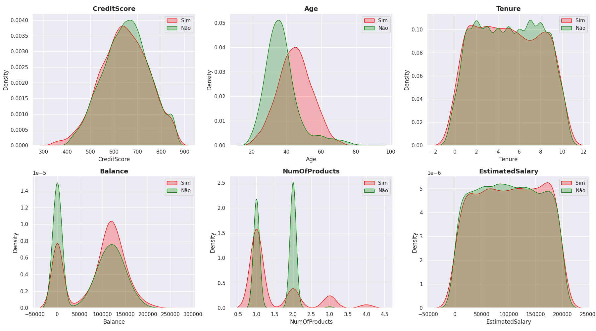

Nesta etapa olhamos para distribuição das variáveis numéricas e algumas conclusões podem ser obtidas:

- Os gráficos de **Tenure** e **EstimatedSalary** apresentam um topo largo, indicando que os valores dessas variáveis estão mais **uniformemente distribuídos** dentro de um certo intervalo. Esta informação indica que não temos um único valor ou faixa de valores dominante. Quando olhamos visando prever o **Churn**, tanto o **Tenure** e **EstimatedSalary** não parecem ser um fator decisivo para os clientes saírem ou permanecerem.

- Os gráficos **Age** e **NumOfProducts** mostram picos estreitos, indicando que há faixas específicas de valores com maior concentração de clientes (com idades específicas ou números de produtos). Estas duas variáveis podem ser úteis na análise preditiva. 

- Para o gráfico **CreditScore** temos uma distribuição simétrica, em que os dados estão próximos de uma distribuição normal. Indicando que a maioria dos clientes tem pontuações de crédito numa faixa considerada comum (média e boa). A simetria também indica que não temos uma forte concentração em extremos, como clientes com pontuações muito baixa ou muito alta. Esta variável é importante na análise preditiva, pois clientes com baixo score tem mais dificuldades de acessar serviços ou produtos financeiros, tornando-os mais propensos a abandonar o banco, e clientes com altas pontuações podem ser alvos de concorrentes oferecendo melhores condições. Obs.: Por ser um grupo com distribuição simétrica, não será necessário um tratamento tão intenso de outliers.

- No gráfico **Balance** temos dois picos principais:
    - Um pico em **0**, provavelmente clientes sem saldo, com contas inativas ou que utilizam o banco apenas para movimentações pontuais;
    - Um segundo pico numa faixa de saldo mais alta (próxima de 100.000 a 150.000), indicando que estes clientes provavelmente possuem uma conta de poupança ou investimento.
Temos então um comportamento bimodal, sugerindo que o banco atende dois grupos principais. Essa segmentação pode indicar que o banco precisa de estratégias para atrair e engajar os dois grupos:
    - **Clientes com saldo baixo:** Ofertas de incentivos para movimentação e engajamento.
    - **Clientes com saldo alto:** Ofertas de produtos premium ou investimentos.
Durante a análise preditiva, provavelmente deveremos tratar esses dois segmentos como classes separadas, assim um não mascara o outro. 

Continuando, os outliers podem influenciar nas análises e no tratamento do modelo preditivo, portanto, vamos buscar identificar os outliers e os seus comportamentos, como podemos ver os gráficos abaixo:

  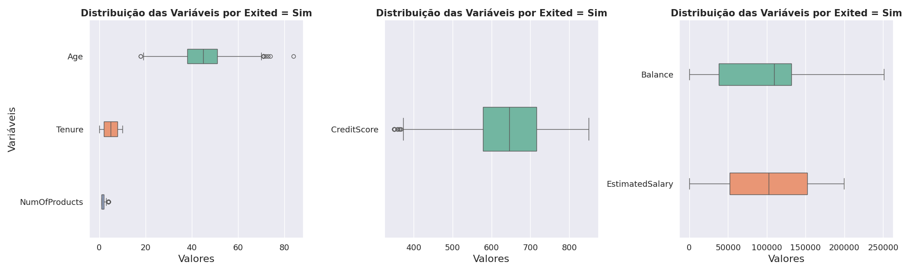
  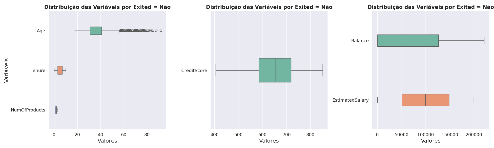

Observe que para boa parte das variáveis não temos muitos outliers, contudo a variável **Age** é a que apresenta mais Outliers. Por hora, não iremos tratar os outliers, iremos treinar o modelo com eles e veremos qual o comportamento do modelo para esses outliers. Podemos voltar aqui se necessário e avaliar como o modelo fica sem os outliers.

Outro ponto que notamos é que a média e a mediana são bastante semelhantes. Como já havíamos comentado, apenas a variável **Balance** possui uma ligeira a diferenciação.

Por fim analisamos também as correlações entre todas as variáveis. O resultado pode ser visto na figura abaixo:

  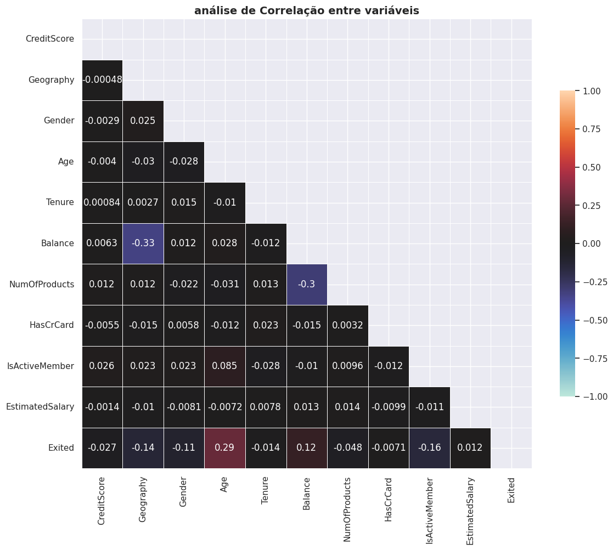

Note que os pares de variáveis com maior correlação são:

- **(Balance, Geography)**
- **(NumOfProducts, Balance)**
- **(Exited, Age)**

É importante ressaltar que aqui não diferenciamos homens de mulheres. Talvez caiba separar esses dois grupos e verificar se existe uma correlação maior se considerarmos apenas mulheres ou homens. O mesmo vale para a variável **Geography**.

## Parte 3 - Preparação dos Dados para modelagem:

Após ganharmos entendimento dos dados, vamos iniciar a nossa fase de preparação dos dados para modelagem. É agora que vamos remover os dados que não são necessários, limpeza, normalização e organização dos dados.

Temos dois bancos de dados, o banco de treino **Abandono_clientes.csv** e **Abandono_teste.csv**. Durante toda essa fase iremos trabalhar apenas com o primeiro banco.

Iniciamos realizando a separação dos dados da seguinte forma:

- 7000 amostras de dados ("`X_train`", "`y_train`") para treinar o modelo;
- 1000 amostras de dados ("`X_test`", "`y_test`") para avaliar o desempenho do modelo em dados "não vistos" no treinamento;
- 500 amostras de dados ("`X_calib`"`y_calib`") para calibração em dados "não vistos" no treino;
- 1000 amostras restantes ("`X_new`"`y_new`") para etapa de previsão conforme e para sua avaliação.

O intuito de separamos o banco em quatro amostras é termos um conjunto de treino, um de teste, e dois outros conjuntos que podem ser usados para calibragem por meio de métodos de calibração, por exemplo, [Previsão Conforme](https://medium.com/data-hackers/uma-introdu%C3%A7%C3%A3o-pr%C3%A1tica-%C3%A0-previs%C3%A3o-conforme-de4c7479e021). Inicialmente essa será nossa distribuição, a depender dos resultados, podemos voltar e alterar estes valores. 

### Parte 3.1 - Baseline

O intuito de criarmos uma baseline é para termos um ponto de partida ao avaliar o desempenho do nosso modelo. Iremos utilizar uma métrica que faz uso de Classificador de taxa aleatória (estimativa ponderada), para ver mais acesse o [artigo](https://towardsdatascience.com/calculating-a-baseline-accuracy-for-a-classification-model-a4b342ceb88f). Desta forma teremos a ZeroR baseline que a taxa mais frequente e a Random Rate (Baseline Ponderada) que é construída a seguir.

- Proporção da Classe Minoritária (Exited = 1): $0.2074$
- Proporção da Classe Majoritária (Exited = 0): $0.7926$

- Odds de Adivinhar Corretamente a Classe Minoritária: $0.20742857142857143^2 = 0.0430$
- Odds de Adivinhar Corretamente a Classe Majoritária: $0.7925714285714286^2 = 0.6282$

- Baseline Ponderado: $0.6712$ ou $67.12\%$

Note que a nossa Baseline Ponderada é de $67,12\%$ e a ZeroR Baseline é de $79,26\%$ estes valores serão os parâmetros de avaliação inicial.

### Parte 3.2 - Transformação nos dados

Vamos fazer a separação das variáveis numéricas e categóricas. Decidimos adicionar `HasCrCard`, `IsActiveMember` como variáveis categóricas, mesmo sendo números. No futuro podemos voltar aqui e rever esta decisão. 

As transformações que vamos fazer são:

- **StandardScaler** para padronizar os valores, inicialmente não iremos tratar os outliers, desejo ver como os modelos lidam considerando esses valores, também não iremos usar o min-max scaler para os valores que não possuem outliers.
- **OneHotEncoder** para transformar as variáveis categóricas do tipo `Gender` e `Geography` em valores binários. 
- **RobustScaler** para tratar os outliers caso necessário.

Concluímos aqui a nossa fase de preparação dos dados para modelagem, vamos iniciar a fase 4.

## Parte 4 - Modelagem

Iremos utilizar alguns dos modelos mais comuns de aprendizado de máquina, são eles:

- **LogisticRegression:** Um classificador de regressão logística, geralmente utilizado para problemas de classificação binaria.

- **DECISION TREE:** Baseado em divisões recursivas de dados em nós.

- **KNeighbors:** Classifica pontos com base nos vizinhos mais próximos.

- **SCV - Support Vector Classifier:** Atua como classificador supervisionado baseado no conceito de Support Vector Machines.

- **Random Forest:** Combina várias árvores de decisão (ensemble) para reduzir overfitting.

- **XGB:** Algoritmo otimizado de gradient boosting.

- **AdaBoost:** Modelo ensemble que ajusta o peso de classificadores fracos.

- **ExtraTrees:** Variante do Random Forest com maior aleatoriedade na seleção de divisões.

- **GradientBoosting:** Modelo ensemble que constrói árvores sequencialmente para corrigir erros.

Iremos identificar quais aqueles que estão acima da nossa baseline, posteriormente, iremos selecionar os 3 melhores comparando a acurácia e a F1-Score entre eles. Uma vez que a Acurácia é uma métrica que indica a capacidade do modelo prever e a F1-Score é uma métrica que avalia o balanço entre previsões positivas e previsões negativas, pois temos duas classes na variável alvo que estão desequilibradas.

Realizamos esta fase inicialmente usando apenas duas transformações: StandardScaler e OneHotEncoder. Posteriormente, usando o RobustScaler. Adicionar o RobustScaler para tratar os outliers não mudou significativamente o desempenho dos modelos. 

Os resultados iniciais são exibidos a seguir:

  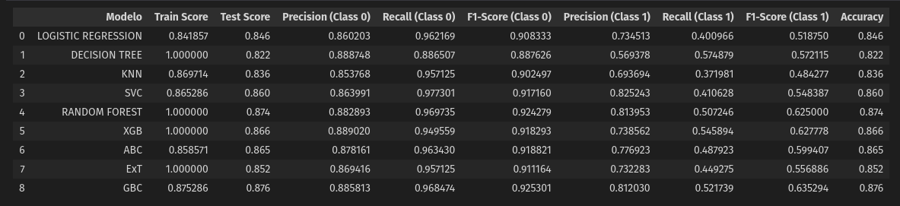

Os três melhores modelos foram o `GradientBoostingClassifier` seguido de `XGBClassifier` e `RandomForestClassifier`. Ambos tiveram a melhor acurácia, mas também os melhores valores de F1-Score na classe minoritária.

## Parte 5 Avaliação

Nesta fase iremos buscar ajustar os modelos anteriores buscando quais são os melhores hiperparâmetros para cada um deles, assim como também avaliar os seus resultados. Infelizmente, não houve melhoras significativas entre as versões iniciais. O motivo é devido os dados ja estarem bem tratados, contendo poucos ou nenhum outliers. 

Contudo, quando avaliamos os modelos com todos os dados, notamos que o Random Forest consegue melhorar muito a sua capacidade. Este modelo consegue tirar proveito do aumento da base de dados, já os outros dois modelos não tiveram um aumento significativo. Os resultados podem ser comparados a seguir:

  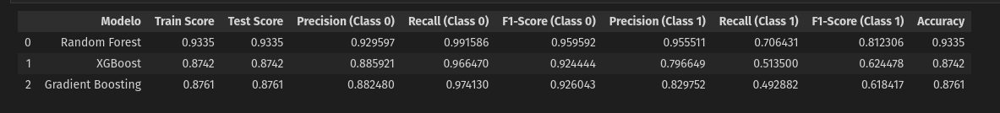

Também podemos comprar os modelos por meio da matriz de confusão, permitindo entender como as previsões feitas pelo modelo correspondem às classes reais dos dados. Para os três modelos trabalhados nesta fase, as matrizes de confusão, podem ser comparadas a seguir:

  

  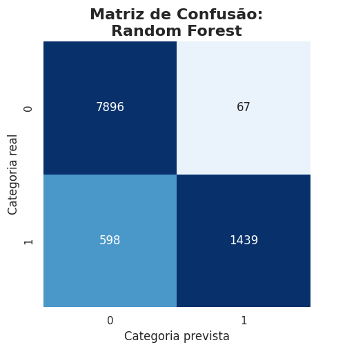
  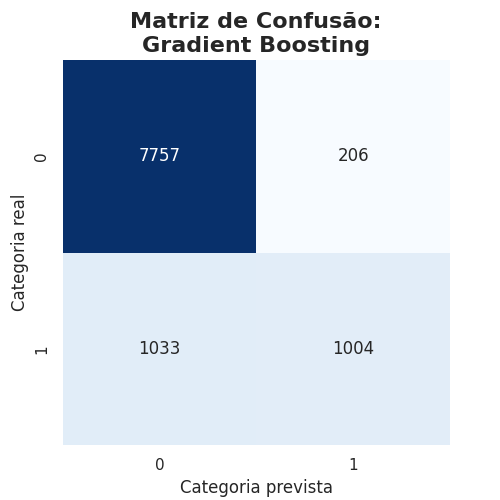 
  
  

Observe que para os modelos Gradient Boosting e XGBoost, a matriz de confusão é para classe $0$ (classe majoritária), são muito próximos, e possuem um alto valor de Falso Positivos (FP), estes modelos estão prevendo que o cliente vão permanecer, mas acabam saindo, quando olhamos para classe $1$ (classe minoritária), estes dois modelos também não atuam tão bem. 

Já o modelo Random Forest, tem um baixo número de Falso Positivos na Classe $0$ e o número de Falso Negativos na Classe $1$ também é bem menor ao compararmos com os outros modelos.

Recapitulando de onde partirmos e até onde chegamos. Iniciamos com uma baseline de $67.12\%$, obtendo $87.63\%$ ao usar os melhores hiperparâmetros e agora com toda a base de dados chegamos em $93\%$ de acurácia e $91\%$ de F1-Score na classe minoritária para o modelo `RandomForestClassifier`, o que nos leva a escolher este modelo.
### Parte 5.1 - Resultado financeiro (Modelo Random Forest)

Para entendermos o impacto do nosso modelo na saúde da empresa, iremos avaliar como o modelo performa em termos de resultados financeiros na base de teste.

Iremos tratar de uma situação simplificada da vida de um banco. Sabemos que toda empresa possui **custo** e **lucro** que impactam nas diretrizes. Com base nas variáveis que temos, podemos identificar alguns custos e lucros para o banco, são elas:

- Número de Produtos:
    - Cada produto gera um lucro médio de $\$50$ por mês.
    - O custo de manutenção de cada produto é $\$10$ por mês.

- Cartão de Crédito:
    - Receita de $\$20$ por mês em taxas de intercâmbio.
    - Receita adicional de $\$15$ por mês com juros médios.
    - Custo de manutenção do cartão é $\$5$ por mês.

- Saldo Médio na Conta:
    - O banco utiliza o saldo para empréstimos com uma margem de lucro de $3\%$ ao mês.
    - O custo operacional associado ao saldo é $1\%$ ao mês.

- Estimativa de Salário:
    - Clientes convertem $10\%$ do salário em produtos financeiros que geram o mesmo lucro médio de $\$50$ por produto.

Essas estimativas são de exemplificação. Contudo, poderíamos obter com o time financeiro os valores mais precisos. 

Podemos, calcular o lucro e o custo por cliente:

- Lucro_prod = Num_pro X (Lucro_prod - Cust_prod)
- Lucro_cr = (Receita_taxa_cr + Receita_juros_cr) - Custo_cr
- Lucro_saldo = Saldo X ( Margem_lucro - Custo_oper) 
- Lucro_conv_salario = (salario X tax_conversao) X Lucro_prod

Vamos assumir os seguintes valores para o nosso exemplo:

| **Parâmetro**                | **Valor**     |
|------------------------------|---------------|
| Margem de lucro sobre o saldo         | 0.03 (3%)     |
| Custo operacional sobre o saldo       | 0.01 (1%)     |
| Taxa de conversão do salário em produtos | 0.1 (10%)     |
| Lucro por produto                      | $50           |
| Custo por produto                      | $10           |
| Receita por taxas de cartão            | $20           |
| Receita por juros de cartão            | $15           |
| Custo de manutenção do cartão          | $5            |
| Custo de retenção por cliente          | $50           |

Após calcular o lucro por cliente e o lucro total, identificamos os clientes:

- **True Positivo (TP):** Clientes em risco corretamente identificados.

- **False Positivo (FP):** Clientes que não estão em risco, mas o modelo previu que estavam em risco.
- **False Negativo (FN):** Clientes em risco, mas o modelo não os identificou.

- **True Negativo:** Clientes que não estavam em risco e foram corretamente identificados.

Cálculos por FP, FN e TP:

- Custo por FP = Num_FP * Custo_de_rentenção
- Perda por FN = soma_de_todo_lucro_FN 
- Ganho por TP = soma_de_todo_lucro_TP - Num_TP * Custo_de_rentenção
- Lucro total = Ganho por TP - Custo por FP - Perda por FN

  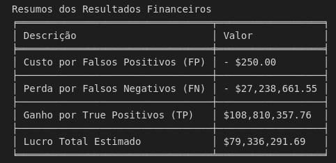

Chegamos ao final do resultado financeiro. Esta seção nos mostrou o papel importante de termos um modelo preditivo.

- A maioria do custo vem dos clientes que foram identificados erroneamente como clientes que iriam permanecer no banco, mas deixaram a empresa. No nosso exemplo, este valor é de $\$27$ milhões.
- No nosso modelo, tivemos apenas 5 Falso Positivo, clientes que foram identificados que iriam ficar no banco, mas deixaram. No qual foram gastos $\$50$ por cliente em campanha para manter estes clientes, totalizando $\$250$.
- Ganho por Clientes em risco identificados, subtraindo o lucro desses clientes pelo custo em campanha, chegamos ao valor de $\$108$ milhões.
- O lucro estimado da empresa chegou por volta de $\$80$ milhões, nos mostrando o impacto de usarmos uma rede neural.
## Parte 6 - Aplicação 

### Parte 6.1 - MlFlow

NEsta ultima fase foi criar uma versão em script com o melhor modelo, salvo na pasta `src` como o nome `train_RF.py`. Utilizamos os recursos do MlFlow para criarmos um cenário mais próximo de uma empresa. 

Foi criado environment chamado `mlflow_env` que irá atuar como o nosso servidor. Dentro do ambiente do Mlflow, criamos um modelo chamado **Churn-Abandono** e a nossa primeira experiência **churn_pedro_indicium**, como visto a seguir:

  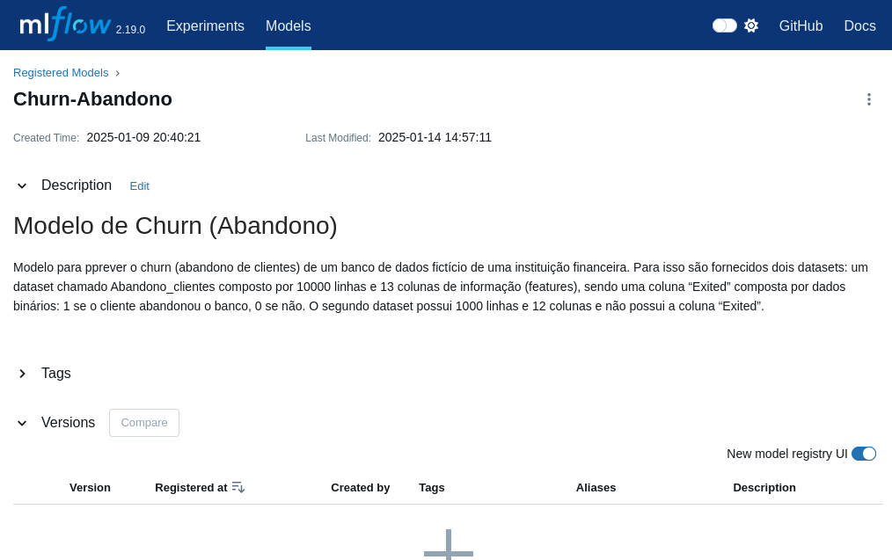
   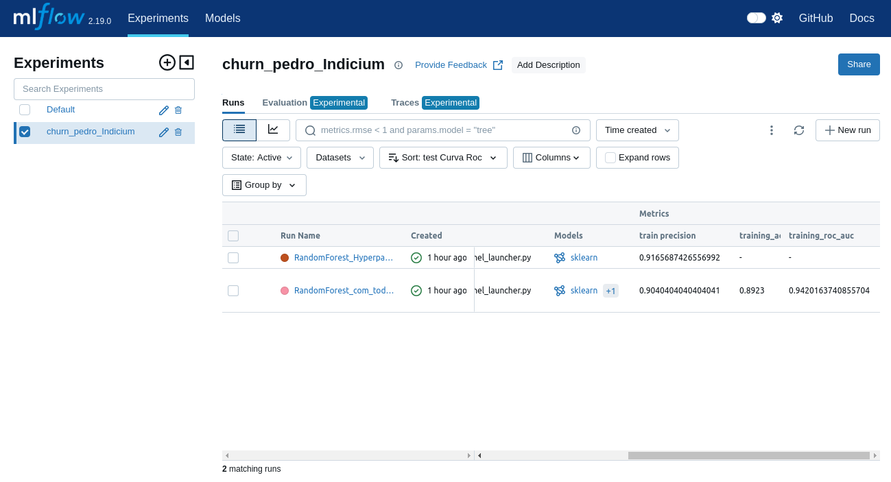

Note que temos duas runs, uma para os hiperparâmetros e outra run na qual o modelo treinou com todos os dados. 

Em seguida, podemos registar o modelo que escolhemos, no caso o `RandomForest_com_todos_os_dados`:

  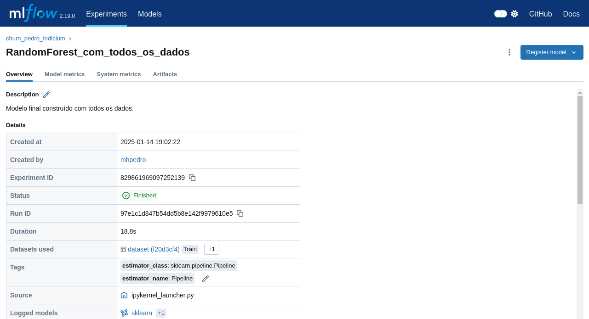

E por fim, colocamos o nosso modelo para produção:

  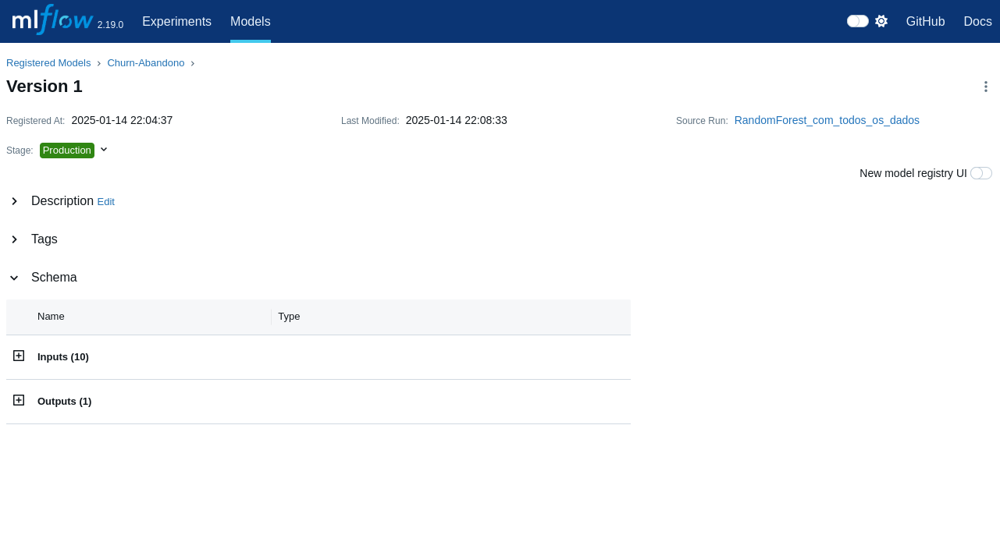

E chegamos ao fim desta subfase.

### Parte 6.2 - Teste final

Finalmente chegamos ao momento decisivo deste desafio, onde o nosso modelo vai ser aplicado num novo dataset, contendo 1000 linhas e 12 colunas. É importante ressaltar que toda a jornada é importante para este momento. 

Agora vamos ver o desempenho do nosso modelo num novo dataset.

Criamos um script [test_RF](src/test_RF.py) com o nosso modelo que realiza a previsão, os resultados das predições podem ser acessadas em [Abandono_clintes_final](./data/Abandono_clientes_final.csv). 

Visualizando distribuição das previsões:

  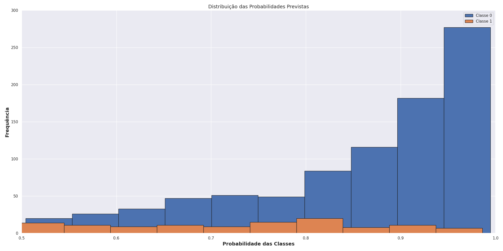

Estes valores indicam-nos que o nosso modelo por mais que realize as predições, é possível notar que para classe majoritária (Classe $0$), mais de $50\%$ das predições foram feitas com uma probabilidade entre $90\%$ à $100\%$. Já na classe minoritária, não temos o mesmo cenário. Cada intervalo de $10\%$ representam por volta de $20\%$ dos dados previsto, o que nos levar a concluir que o nosso modelo ainda precisa de ajustes.

Outra métrica interessante para analisar é a entropia, para este modelo, a entropia média das previsões é de $0.37$. Este valor nos indica a incerteza das previsões, quanto mais próximo de $0$ mais certo o modelo, o nosso valor está abaixo do $0.5$, indicando que a maioria das previsões tem probabilidades longe de $0.5$, indicando confiança, contudo este valor nos sugere que o modelo ainda precisa ser aprimorado.

# Conclusão 

Chegamos ao final do desafio com um resultado satisfatório, o nosso modelo está superior a baseline e obteve uma acurácia de $93\%$. É importante notar que os dados já estavam bem tratados, não possuindo **NaN**. Num cenário real, seria necessário criar e atuar com mais tratamento.

Há ainda diversos pontos que podem ser melhorado no modelo, como por exemplo:

  - **Validar com o time de Negócios:** Ter conhecimento do negócio é a bala de prata para melhorar o nosso modelo, caso contrário, como saberíamos que as análises e resultados estão conforme esperados? Portanto, durante a fase exploratória, qualquer descoberta, insights ou hipóteses validadas, ou não deve ser confrontada, se possível, com o time de negócios.

  - **Balance:** A variável Balance possui um comportamento bimodal, sugerindo que o banco atende dois grupos principais, poderíamos separar em duas classes para melhorar o nosso modelo.

  - **Modelo:** O modelo escolhido foi o Random Forest por obter um desempenho ótimo treinamos com todo o conjunto de dados, contudo, outros modelos poderiam ser escolhidos. 

  - **Previsão Conforme:** A utilização de previsão conforme com os dados de calibragem seria um bom ponto para melhorar o nosso modelo. Contudo, não tive tempo para poder aplicar tais técnicas, mas fica como sugestão para os futuros ajustes.

  - **Desbalanceamento das classes:** O desbalanceamento das classes alvo pode ter afetado significativamente o nosso modelo. Uma forma de lidar, seria utilizar o Undersampling, para deduzir o número de observações da classe majoritária e aumentar o número de observações da classe minoritária. Ao contrário do Undersampling, poderíamos criar dados sinteticamente por meio das observações da classe minoritária por meio do Oversampling, tais técnicas podem serem vistas em [Dados Desbalanceados — O que são e como lidar com eles](https://medium.com/turing-talks/dados-desbalanceados-o-que-s%C3%A3o-e-como-evit%C3%A1-los-43df4f49732b).

Resumidamente, nesta primeira versão do modelo, julgo que poderíamos colocar em produção e ver como o modelo se comporta e no decorrer implementar as melhorias necessárias. Partimos com uma baseline de $67.12\%$, obtendo $87.63\%$ ao usar os melhores hiperparâmetros, por fim com toda a base de dados chegamos em $93\%$ de acurácia e $91\%$ de F1-Score na classe. Por fim, chegamos a uma taxa de Churn de ~$12\%$ este valor nos diz que devemos buscar manter os clientes, antes de realizarmos uma expansão da empresa.

# Contato

- [Linkedin](https://www.linkedin.com/in/mhpedro/)
- [GitHub](https://github.com/Mhpedro)
- [Gmail](ircefasjp@gmail.com)